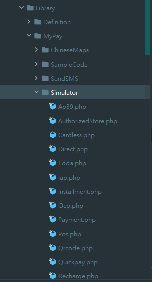

# 模擬串接金流服務

模擬串接金流的頁面都集中在Mypay/Simulatr裡面，如下：

<figure><figcaption></figcaption></figure>

這些class代表的都是不同類別，依照功能在對應的類別新增(如果沒有對應的類別，就新增)，這次新增的類別為AuthorizedStore.php

```php
/**
 * 建立特約商店申請網址
 * @return array
 */
public function entranceapplicant(): array
{
    // 要POST的Data
    $rawData = array();
    $rawData['agent_uid'] = "289151881003";
    $rawData['code']  = "20221221000002";

    // 送至服務位置
    $service = array(
        'service_name' => 'store',
        'cmd' => 'api/authorizedentrancestore'
    );

    // service(服務位置)、encry_data(加密資料)、request(request格式)、response(response格式)、source(功能關鍵字)
    return ['service' => $service, 'encry_data' => $rawData, 'request' => AuthorizedEntranceApplicantVO::class, 'response' => ReturnCodeAuthorizedEntranceStoreApplicantVO::class, 'source' => 'EntranceApplicant'];
}
```

因為要產生五種不同語言的範例程式，所以完成後要記得下這個指令：

php .\artisan Simulator:api AuthorizedStore --name=entranceapplicant --sample=1 --type=agent

#### 指令參數說明：

* api = 類別class名稱
* name = 方法
* sample = 是否要建立，預設值請給1
* type = api類型，agent、store等
